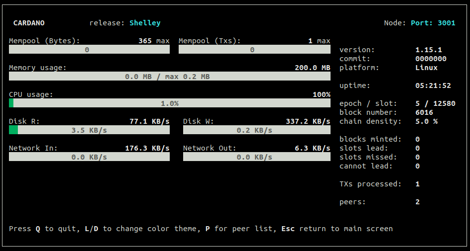

# Running the node in LiveView mode

Running the node in LiveView mode requires some tweaks to the config.json file:

Open the conf.json file in your text editor, for example:

    nano shelley_testnet-config.json

**Tracers**

Set "TraceBlockFetchDecisions" to **true**

	{
	  "ApplicationName": "cardano-sl",
	  "ApplicationVersion": 0,
	  "GenesisFile": "shelley_testnet-genesis.json",
	  "LastKnownBlockVersion-Alt": 0,
	  "LastKnownBlockVersion-Major": 0,
	  "LastKnownBlockVersion-Minor": 0,
	  "Protocol": "TPraos",
	  "RequiresNetworkMagic": "RequiresMagic",
	  "TraceBlockFetchClient": false,
	  "TraceBlockFetchDecisions": true,
	  "TraceBlockFetchProtocol": false,
	  "TraceBlockFetchProtocolSerialised": false,
	  "TraceBlockFetchServer": false,
	  "TraceChainDb": true,
	  "TraceChainSyncBlockServer": false,
	  "TraceChainSyncClient": false,
	  "TraceChainSyncHeaderServer": false,
	  "TraceChainSyncProtocol": false,
	  "TraceDNSResolver": true,
	  "TraceDNSSubscription": true,
	  "TraceErrorPolicy": true,
	  "TraceForge": true,
	  "TraceHandshake": false,
	  "TraceIpSubscription": true,
	  "TraceLocalChainSyncProtocol": false,
	  "TraceLocalErrorPolicy": true,
	  "TraceLocalHandshake": false,
	  "TraceLocalTxSubmissionProtocol": false,
	  "TraceLocalTxSubmissionServer": false,
	  "TraceMempool": true,
	  "TraceMux": false,
	  "TraceTxInbound": false,
	  "TraceTxOutbound": false,
	  "TraceTxSubmissionProtocol": false,
	  "TracingVerbosity": "NormalVerbosity",
	  "TurnOnLogMetrics": true,
	  "TurnOnLogging": true

**ViewMode**

Set ViewMode to **LiveView**

	  "ViewMode": "LiveView",

**Configure logs to be saved to a file**

	  "defaultScribes": [
	    [
	      "FileSK",
	      "logs/node.log"
	    ]

    ...

	  "setupScribes": [
	    {
	      "scFormat": "ScText",
	      "scKind": "FileSK",
	      "scName": "logs/node.log",
	      "scRotation": null
	    }
	  ]
	}

**Start the node normally**

    cardano-node run ...

**See logs**

If you need to see the node logs you can **tail** the **node.log** file

    tail -f node.log
